  

# 🛰️ Awesome Geospatial Intelligence 🌍

  
  
  
  
  

> 🚀 **Comprehensive SEO & Industry Guide to Geospatial Intelligence (GEOINT)**: A curated showcase of commercial **SaaS platforms** and high-performance **open-source GitHub projects** for **Earth Observation (EO)**, **Satellite Imagery Analysis**, **Remote Sensing**, **Spatial Data Warehousing**, and **GIS Engineering**.

---

## 📑 Table of Contents

- [📊 Market Overview & Industry Dynamics](#-market-overview--industry-dynamics)
- [🏢 SaaS & Hosted Commercial Platforms](#-saas--hosted-commercial-platforms)
- [💻 Open-Source GitHub Projects](#-open-source-github-projects)
- [🛠️ Additional Open-Source Geospatial Libraries](#️-additional-open-source-geospatial-libraries)
- [🤝 How to Contribute](#-how-to-contribute)
- [⚠️ Disclaimer](#%EF%B8%8F-disclaimer)
- [💖 Support & Sponsorship](#-support--sponsorship)
- [📈 Star History](#-star-history)

---

## 📊 Market Overview & Industry Dynamics

> 💡 **Market Size & Fragmentation**: The global **Geospatial Intelligence (GEOINT)** market is estimated at **$88.3 Billion in 2026** and is projected to surpass **$145 Billion by 2030** (CAGR ~13.2%). The sector is **moderately fragmented**: foundational map tiles/base APIs are anchored by large scale players (e.g., Esri, Mapbox), while vertical Earth Observation AI, automated change detection, spatial data warehousing, and synthetic aperture radar (SAR) analytics feature rapid innovation across specialized high-growth ventures and open-source ecosystems.

---

## 🏢 SaaS & Hosted Commercial Platforms

Below is a detailed comparison of top commercial geospatial intelligence & remote sensing SaaS platforms, ordered by **Company Scale / Valuation / Revenue (Descending)**.

| SaaS Platform 🌐 | Scale / Valuation / Revenue 💰 | Starting Pricing (Paid Tier) 💳 | Free Tier & Free Trial Limits ⏳ | Description & Key Capabilities 🎯 |
| :--- | :--- | :--- | :--- | :--- |
| **[Esri ArcGIS Online](https://www.esri.com/en-us/arcgis/products/arcgis-online/overview)** 🗺️ | **~$1.7B Annual Revenue** (Market Leader, Private) | **$550/user/year** (Creator License) | **21-Day Free Trial** (Includes 500 ArcGIS Service Credits & 5 Creator user licenses) | Premier enterprise GIS & spatial analytics suite; offers deep cartography, story maps, and spatial statistics. |
| **[Mapbox](https://www.mapbox.com/)** 📍 | **~$1.3B Valuation** (Unicorn, SoftBank-backed) | **$0.50 per 1,000 requests** (Pay-as-you-go above free tier) | **Free Forever Tier**: 50,000 mobile monthly active users (MAUs) or 50,000 web map loads/month | Industry standard developer API platform for interactive vector maps, navigation SDKs, and geocoding. |
| **[Nearmap](https://www.nearmap.com/)** ✈️ | **~$750M Acquisition Value** (Acquired by Thoma Bravo) | **$1,200/year** (Small Business entry tier) | **7-Day Free Trial** (Includes access to high-res aerial imagery samples for designated area) | High-resolution aerial imagery provider (up to 5cm resolution) updated frequently across AU, NZ, and NA. |
| **[CARTO](https://carto.com/)** 📊 | **~$150M Market Valuation** (Series C) | **$199/month** (Individual Pro tier) | **14-Day Free Trial** (Full access to Cloud Native platform connected to Snowflake/BigQuery) | Cloud-native spatial analytics engine for data warehouses; provides spatial SQL, Moran's I, and Getis-Ord. |
| **[Picterra](https://picterra.ch/)** 🛰️ | **~$50M Valuation** (Venture-backed Series A) | **$490/month** (Base Professional subscription) | **14-Day Free Trial** (Includes 100 free AI processing credits & custom model training testing) | No-code Geospatial AI platform for object detection, land cover segmentation, and satellite imagery change monitoring. |
| **[Felt](https://felt.com/)** 🎨 | **~$45M Valuation** (Series A, Bain Capital Ventures) | **$30/user/month** (Team Plan) | **Free Forever Tier**: Up to 5 personal maps, 250MB storage, unlimited collaborators | Next-gen collaborative web mapping workspace for real-time multiplayer map editing, annotation, and spatial analysis. |
| **[Safe Software FME Cloud](https://www.safe.com/fme/fme-cloud/)** 🔄 | **~$40M Enterprise SaaS Division** (Bootstrapped Leader) | **$1.00/hour** (Pay-as-you-go instance rate) | **$250 Free Credit Trial** (Valid for 60 days on FME Cloud instances) | Spatial Data Transformation (ETL) cloud platform; supports 400+ vector, raster, LiDAR, and CAD formats. |
| **[UP42](https://up42.com/)** 🛍️ | **~$35M Valuation** (Airbus Defense & Space Subsidiary) | **€100 minimum credit top-up** (Pay-as-you-go processing) | **10,000 Free Credits on Signup** (Valid for testing Earth observation algorithms and satellite data samples) | Developer marketplace and API platform providing multi-provider satellite imagery (Airbus, Planet, Capella) & pipelines. |
| **[Descartes Labs](https://descarteslabs.com/)** 🌾 | **~$30M Acquisition Value** (Acquired by Antarctica Capital) | **$2,500/month** (Developer API Subscription) | **30-Day Enterprise Demo Trial** (Includes access to planetary dataset catalog & historical Sentinel/Landsat archives) | Planetary-scale geospatial analytics platform combining satellite data with ML for agriculture, carbon, & supply chain. |
| **[Orbital Insight](https://orbitalinsight.com/)** 🔍 | **~$25M Asset Value** (Acquired by Private Investor Group) | **$3,000/month** (GO Platform Base License) | **14-Day Guided Demo Access** (Includes sample global supply chain & foot-traffic monitoring datasets) | AI-driven remote sensing intelligence platform tracking economic activity, real-time supply chain, and global infrastructure. |

---

## 💻 Open-Source GitHub Projects

Below are top open-source GIS engines, libraries, and web platforms, ordered by **GitHub Stars_Counts (Descending)**.

| Project 📦 | GitHub Stars_Count ⭐ | License 📜 | Description & Primary Use Case 🛠️ |
| :--- | :--- | :--- | :--- |
| **[QGIS](https://github.com/qgis/QGIS)** |  | GPL-2.0 | The gold standard open-source desktop GIS. Full spatial processing, cartography layout engine, and thousands of Python plugins. |
| **[OpenLayers](https://github.com/openlayers/openlayers)** |  | BSD-2-Clause | High-performance, feature-packed JS web mapping library supporting WMS, WFS, GeoJSON, and vector tile rendering. |
| **[MapLibre GL JS](https://github.com/maplibre/maplibre-gl-js)** |  | BSD-3-Clause | The open-source TypeScript fork of Mapbox GL JS for fast, GPU-accelerated web vector map rendering without vendor lock-in. |
| **[GeoLibre](https://github.com/opengeos/GeoLibre)** |  | Apache-2.0 | Next-gen AI-powered GIS workspace with natural language spatial assistants, SAM-Geo segmentation, ONNX YOLO detection, and Jupyter sync. |
| **[GDAL/OGR](https://github.com/OSGeo/gdal)** |  | MIT/X11 | The foundational C++ geospatial data translation library reading/writing 200+ spatial vector and raster formats globally. |
| **[OpenFreeMap](https://github.com/hyperknot/openfreemap)** |  | MIT | Free public map tile hosting service allowing users to display custom vector map styles with zero API key requirements. |
| **[GeoPandas](https://github.com/geopandas/geopandas)** |  | BSD-3-Clause | Open-source Python library extending pandas data objects to enable geometric operations on spatial data types. |
| **[Shapely](https://github.com/shapely/shapely)** |  | BSD-3-Clause | Computational geometry library for manipulation and analysis of planar features in Python, built on GEOS. |
| **[GeoServer](https://github.com/geoserver/geoserver)** |  | GPL-2.0 | Enterprise Java server for sharing geospatial data; implements OGC standards including WMS, WFS, WCS, and WMTS. |
| **[Leafmap](https://github.com/opengeos/leafmap)** |  | MIT | Comprehensive Python package for interactive geospatial mapping and Earth observation data analysis in Jupyter notebooks. |
| **[Photon](https://github.com/komoot/photon)** |  | Apache-2.0 | Open-source geocoder built on top of OpenStreetMap and Elasticsearch; drop-in replacement for commercial geocoding APIs. |
| **[Rasterio](https://github.com/rasterio/rasterio)** |  | BSD-3-Clause | Fast, idiomatic Python access to geospatial raster data formats (GeoTIFF, COG) powered by GDAL. |
| **[PostGIS](https://github.com/postgis/postgis)** |  | GPL-2.0 | Spatial database extender for PostgreSQL providing ST_Intersects, ST_Buffer, indexing, and high-speed spatial SQL queries. |
| **[PDAL](https://github.com/PDAL/PDAL)** |  | BSD-3-Clause | Point Data Abstraction Library for filtering, transforming, and processing point cloud data & LiDAR (LAS/LAZ). |
| **[GeoTrellis](https://github.com/locationtech/geotrellis)** |  | Apache-2.0 | Scala/Spark framework designed to process high-volume raster data and geospatial imagery in distributed environments. |
| **[GeoNetwork](https://github.com/geonetwork/core-geonetwork)** |  | GPL-2.0 | Catalog application for spatial metadata management, backed by UN-OCHA, FAO, and WFP standard implementations. |
| **[TiTiler](https://github.com/developmentseed/titiler)** |  | MIT | Lightweight dynamic tile server built on FastAPI and Rasterio for Cloud Optimized GeoTIFFs (COGs) and STAC items. |
| **[Dekart](https://github.com/dekart-xyz/dekart)** |  | MIT | Open-source visual backend for Kepler.gl connecting directly to BigQuery, Snowflake, and Postgres with LLM agent MCP support. |

---

## 🛠️ Additional Open-Source Geospatial Libraries

- **🖥️ Desktop GIS Workspaces**: **[QGIS](https://github.com/qgis/QGIS)** (richest desktop ecosystem), **[GeoLibre](https://github.com/opengeos/GeoLibre)** (AI-integrated natural language GIS), **[Brew GIS](https://github.com/zbyte64/brewgis)** (Docker & dbt urban planning workspace).
- **🌐 Web Tile Servers & Dynamic APIs**: **[TiTiler](https://github.com/developmentseed/titiler)** (FastAPI COG tile server), **[Dekart](https://github.com/dekart-xyz/dekart)** (Kepler.gl cloud warehouse viewer), **[Martin](https://github.com/maplibre/martin)** (PostGIS/PMTiles vector tile server).
- **📡 Satellite & Earth Observation Processing**: **[eo-learn](https://github.com/sentinel-hub/eo-learn)** (Earth observation ML pipelines), **[Sen2Like](https://github.com/snk2like/sen2like)** (Sentinel-2 & Landsat 8/9 image harmonization), **[openEO](https://github.com/Open-EO/openeo-api)** (Interoperable EO cloud backend API specification).
- **☁️ Point Clouds & LiDAR Analytics**: **[PDAL](https://github.com/PDAL/PDAL)** (LiDAR pipeline processing), **[GeoTrellis](https://github.com/locationtech/geotrellis)** (Geospatial raster/point cloud distributed computation).
- **📷 Street-Level & Imagery Crowdsourcing**: **[Panoramax](https://github.com/panoramax)** (Federated open street-level photo network with 23M+ photos).
- **🗺️ Vector Tile Provider**: **[OpenFreeMap](https://github.com/hyperknot/openfreemap)** (Free, ultra-fast vector tile server with zero API limits).

---

## 🤝 How to Contribute

Contributions are highly appreciated! To contribute to this awesome list:

1. Fork this repository.
2. Add or update entries in `README.md` keeping formatting consistent.
3. Ensure factual descriptions, verified starting prices for SaaS, or valid GitHub links and licenses for open-source software.
4. Open a Pull Request (PR) with a brief summary of additions.

Refer to the curated collection index on [Awesome-Awesome-Awesome](https://github.com/ishandutta2007/Awesome-Awesome-Awesome) for complementary developer resources.

---

## ⚠️ Disclaimer

- This curated list is maintained by the community for informational and research purposes only.
- Commercial SaaS valuations, starting subscription prices, and free tier limits are verified periodically but are subject to vendor changes.
- Always check compliance regulations regarding spatial data privacy, sovereign geospatial data laws, and remote sensing imagery distribution licenses before deploying production systems.

---

## 💖 Support & Sponsorship

If you find **Awesome Geospatial Intelligence** useful for your research, team, or production workflows, please consider giving this repository a ⭐ **Star** and sharing it with colleagues!

  

Thank you for supporting open-source spatial intelligence! Every star, fork, and sponsor contribution helps keep this dataset updated and accurate.

---

## 📈 Star History

